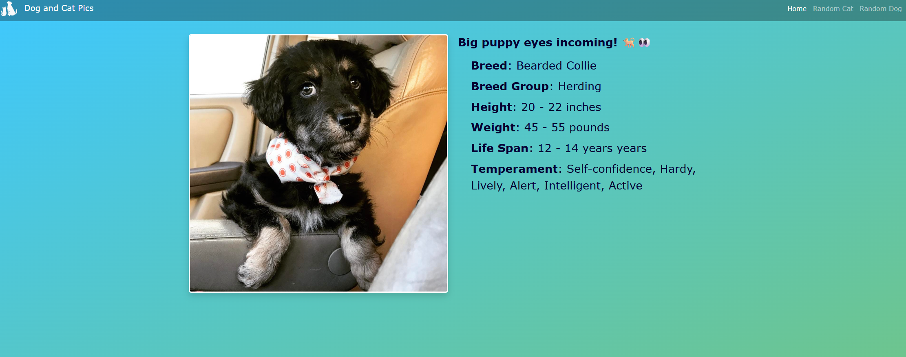

## Dog & Cat Pics

  
  

A fun and simple Flask web app that fetches random dog and cat pictures, along with breed info, temperament, weight, height, and a random cute comment.
All powered by TheDogAPI and TheCatAPI.
Go to <a href = "https://dog-and-cat-pics.onrender.com/">Dog & Cat Pics</a> to see the live website!

⭐ Features

🐕 Random dog images

🐈 Random cat images

📊 Breed information when available

💬 Random cute comments

🔧 Fully powered by Flask + external APIs

🎨 Bootstrap styling with a gradient background

🛠️ Tech Stack

 <table width="100%"> 
    <h3>🧩 Backend</h3>
    Python (Flask)
    <h3>🎨 Frontend</h3>
    <ul style="text-align: left; display: inline-block; margin: 0; padding: 0;">
      <li>HTML</li>
      <li>CSS</li>
      <li>JavaScript</li>
      <li>Bootstrap 5</li>
      <li>Jinja2 Templates</li>
    </ul>
    <h3>🌐 APIs</h3>
    <a href="https://thedogapi.com">TheDogAPI</a> 
    <a href="https://thecatapi.com">TheCatAPI</a>

  
## 🚀 How It Works

The backend uses Flask to make requests to TheDogAPI and TheCatAPI:

Fetches random animal images

Extracts breed + traits (when available)

Generates a random custom comment

Passes all data into Jinja2 templates

APIs require an API key, which you set through .env (locally) or Render’s environment variables.

## 📸 App Pages
<h3>🏠 Home </h3>

Explains how the site works and links to each animal page.

<h3>🐶 dog </h3>

Displays:

Random dog photo

Breed, temperament, size, life span (if provided)

A random funny comment

<h3>🐱 cat </h3>

Displays:

Random cat photo

Random cute comment
